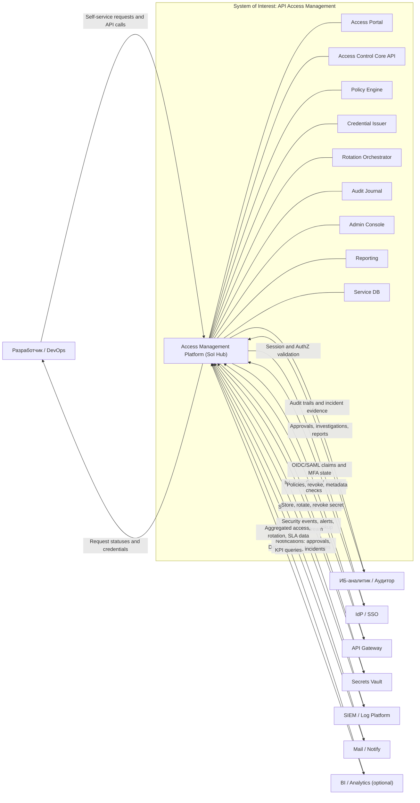

# API Access Management (Security/Platform)

Полный пакет артефактов для кейса: сервис управления разрешениями и доступом к API.

## 1. Контекст и границы SoI

### 1.1 Цель системы (миссия)

Система API Access Management должна обеспечивать self-service выдачу и управление API-доступом для внутренних команд разработки без потери контроля ИБ, с гарантируемой трассируемостью действий, управляемым жизненным циклом секретов и проверяемыми политиками доступа.

### 1.2 Контекст (среда и внешние системы)

1. Эксплуатационная среда: enterprise B2B-платформа, единый IdP/SSO, внутренние API-продукты.
2. Операционный контур: Platform Engineering + DevOps + Security Operations.
3. Каналы взаимодействия:
   1. UI self-service портал.
   2. Сервисные API для CI/CD.
   3. Событийная интеграция для аудита и мониторинга.
4. Ключевые ограничения:
   1. Только внутренние команды одной организации.
   2. Централизованные политики и approval flow для критичных изменений.
   3. Интеграции с внешними компонентами обязательны: SSO, Gateway, Vault, SIEM, Mail.

### 1.3 Контекстная диаграмма (L0: SoI ↔ внешние сущности)

Ниже приведена текстовая декомпозиция той же диаграммы в формате `External Entity ↔ Flow`.

| Внешняя сущность | Поток в систему | Поток из системы |
| --- | --- | --- |
| IdP/SSO | OIDC/SAML assertions, group claims, MFA state | AuthN/AuthZ decisions, session validation requests |
| API Gateway | Запросы на валидацию токена/ключа, policy check requests | Активные политики, deny/allow metadata, revocation updates |
| Secrets Vault | Статусы хранения секретов, version metadata | Создание/обновление/отзыв секретов, rotation jobs |
| SIEM / Log Platform | Correlation lookup, incident tags | Audit events, security alerts, policy-change events |
| Mail/Notify | Delivery status, bounce/failure events | Уведомления о заявках, approvals, ротации, инцидентах |
| BI/Analytics (опц.) | Запросы срезов и KPI | Агрегированные отчеты по доступам, ротациям, SLA |
| CI/CD системы | Machine-to-machine access requests | Service credentials, scoped tokens, operation results |

### 1.4 Границы SoI

#### 1.4.1 Внутри SoI

1. `Access Portal`: UI для self-service операций и статусов.
2. `Policy Engine`: централизованная оценка политик доступа.
3. `Credential Issuer`: выпуск API keys/tokens, отзыв и TTL-контроль.
4. `Rotation Orchestrator`: плановая и аварийная ротация.
5. `Audit Journal`: неизменяемый журнал событий безопасности и администрирования.
6. `Admin Console`: управление шаблонами, approvals, делегированием ролей.
7. `Reporting`: SLA/SLO, compliance-отчеты, операционные метрики.
8. `Service DB`: метаданные приложений, политик, заявок, состояний.

#### 1.4.2 Снаружи SoI

1. `IdP/SSO`.
2. `API Gateway`.
3. `Secrets Vault`.
4. `SIEM`.
5. `Mail/Notify`.
6. `BI/Analytics`.

## 2. CONOPS / OPSCON

### 2.1 Роли и поведение

1. `Разработчик`
   1. Цель: быстро получить доступ к API для разработки/интеграции.
   2. Действия: регистрирует приложение, запрашивает политику и credential, инициирует ротацию в рамках прав.
   3. Ограничения: не может обходить approval flow, не может повышать привилегии выше профиля команды.
   4. Критичные ожидания: понятный статус заявки, прозрачные причины отказа, быстрый отзыв при инциденте.
2. `DevOps`
   1. Цель: автоматизировать выпуск/ротацию в CI/CD.
   2. Действия: использует сервисные API, запускает плановые ротации, контролирует интеграции с Gateway/Vault.
   3. Ограничения: только machine roles, scoped доступ к конкретным API-продуктам.
   4. Критичные ожидания: idempotent API, предсказуемые ошибки, минимальные простои.
3. `ИБ-аналитик`
   1. Цель: управлять риском доступа и расследовать инциденты.
   2. Действия: согласует/отклоняет risky changes, анализирует deny-события, инициирует emergency revoke.
   3. Ограничения: не изменяет бизнес-параметры приложений вне security scope.
   4. Критичные ожидания: неизменяемый журнал, correlation-id везде, полнота телеметрии.
4. `Администратор платформы`
   1. Цель: поддерживать работоспособность системы и governance.
   2. Действия: настраивает шаблоны политик, роли, интеграции, обслуживает сбои и деградации.
   3. Ограничения: разделение обязанностей (SoD), админ-действия аудитируются.
   4. Критичные ожидания: наблюдаемость, контроль версии схем, безопасные миграции.
5. `Аудитор`
   1. Цель: подтверждать соответствие требованиям контроля доступа.
   2. Действия: запрашивает отчеты, проверяет трассируемость заявка→approval→выдача→использование→отзыв.
   3. Ограничения: read-only доступ, без operational mutations.
   4. Критичные ожидания: экспортируемые доказательства, целостность журналов, понятные KPI/SLA.

### 2.2 Системные элементы (типовая конфигурация)

1. Web UI `Access Portal`.
2. Core API `Access Control Service`.
3. `Policy Engine`.
4. `Credential Issuer`.
5. `Rotation Orchestrator`.
6. `Audit Journal` + event bus.
7. `Admin Console`.
8. `Service DB`.
9. Внешние интеграции: IdP/SSO, API Gateway, Vault, SIEM, Mail.

### 2.3 Сценарий S1. Регистрация приложения и запрос API-доступа

#### Цель

Команда регистрирует приложение и создает первичный запрос на доступ к API-продукту.

#### Условия начала

1. Пользователь аутентифицирован через SSO.
2. Команда и окружение (`dev/test/prod`) заведены.
3. API-продукт опубликован в каталоге.

#### Основной поток (Happy path)

1. Разработчик создает application profile.
2. Выбирает API-продукт, окружение и шаблон доступа.
3. Система валидирует team scope и обязательные поля.
4. Запрос получает `request_id` и статус `Submitted`.
5. Если риск низкий, применяется auto-approval policy, иначе заявка уходит на security approval.
6. Пользователь видит итоговый статус и SLA по обработке.

#### Результат

1. Создана сущность приложения.
2. Создан и зафиксирован access request.

#### Исключения

1. Пользователь без нужной роли: отказ `403`.
2. API-продукт архивирован: отказ `422`.
3. Конфликт имени приложения в team scope: `409`.

#### Режимы деградации

1. `SSO` недоступен: вход блокируется, active sessions работают до истечения TTL.
2. `Mail` недоступен: уведомление ставится в retry queue, UI показывает статус without email delivery.

### 2.4 Сценарий S2. Выпуск ключа/токена с политикой и сроком действия

#### Цель

Выдать credential (API key или OAuth client credential) с ограниченной политикой и TTL.

#### Условия начала

1. Есть approved access request.
2. Привязана policy.
3. Vault и Gateway доступны.

#### Основной поток

1. Пользователь выбирает тип credential и TTL в разрешенных границах.
2. Система проверяет policy constraints и approval state.
3. Credential Issuer генерирует секрет и сохраняет в Vault.
4. В Gateway публикуется связка subject/policy/revocation hooks.
5. Пользователь получает reference и metadata (сам секрет только один раз).
6. Audit Journal фиксирует issuance chain.

#### Результат

1. Credential выпущен и активен.
2. Политика применена на Gateway.

#### Исключения

1. Vault недоступен: выпуск не завершен, статус `PendingIntegration`.
2. Gateway reject policy: выпуск отменяется с rollback.
3. Нарушение TTL policy: `422`.

#### Режимы деградации

1. При частичной недоступности Gateway credential создается в статусе `Staged`, не `Active`.
2. При недоступности Mail выдача не блокируется, уведомления в очереди.

### 2.5 Сценарий S3. Изменение политики доступа (approval flow ИБ)

#### Цель

Изменить scope доступа к API по контролируемому процессу согласования.

#### Условия начала

1. Существует активная policy.
2. Пользователь имеет право инициировать change request.
3. Настроены правила risk scoring.

#### Основной поток

1. Инициатор создает policy change request.
2. Система вычисляет risk level.
3. Для medium/high риска запускается обязательное согласование ИБ.
4. После approval создается новая версия policy.
5. Gateway получает обновление политики.
6. Старые версии переводятся в `Superseded`.

#### Результат

1. Policy version updated, chain of approvals сохранен.

#### Исключения

1. Эскалация привилегий вне шаблона: автоотклонение.
2. Конфликт версий при конкурентном изменении: `409`, нужен rebase на актуальную версию.

#### Режимы деградации

1. Mail down: approvals доступны через UI, почтовые уведомления асинхронны.
2. SIEM down: change применяется, audit events накапливаются в durable queue.

### 2.6 Сценарий S4. Плановая/аварийная ротация секрета без простоя

#### Цель

Сменить секреты с минимизацией окна риска и без сервисного downtime.

#### Условия начала

1. Есть активный credential.
2. Определен режим: planned или emergency.
3. Целевые сервисы поддерживают dual-secret период.

#### Основной поток

1. Запуск rotation request.
2. Генерация нового секрета и запись в Vault.
3. Обновление Gateway и downstream consumers.
4. Период overlap старого и нового секрета.
5. Проверка успешности трафика с новым секретом.
6. Отзыв старого секрета.

#### Результат

1. Новый секрет активирован.
2. Старый секрет отозван в контролируемом окне.

#### Исключения

1. Невозможно обновить consumer: rollback/продление overlap.
2. Vault write failure: ротация переводится в `Failed`, old secret остается активным.

#### Режимы деградации

1. Vault partial outage: emergency revoke возможен через Gateway denylist и short TTL.
2. SIEM lag: security events буферизуются и отправляются позже.

### 2.7 Сценарий S5. Аудит и расследование инцидента по журналу доступа

#### Цель

Восстановить цепочку событий и подтвердить корректность реакций системы при инциденте.

#### Условия начала

1. Инцидент зарегистрирован.
2. Есть correlation-id или субъект расследования.
3. Доступны журналы audit и gateway telemetry.

#### Основной поток

1. Аудитор/ИБ запускает расследование по идентификатору.
2. Система собирает issuance/policy/revocation/access events.
3. Формируется временная шкала и список аномалий.
4. ИБ принимает решение: revoke, policy tighten, escalation.
5. Формируется доказательная выгрузка для compliance.

#### Результат

1. Подготовлен проверяемый incident report.
2. Исполнены корректирующие действия.

#### Исключения

1. Неполные логи из внешней системы: отчет маркируется как `EvidenceGap`.
2. Несоответствие времени событий: выполняется нормализация по trusted time source.

#### Режимы деградации

1. SIEM недоступен: используется локальный неизменяемый журнал и deferred enrichment.
2. BI недоступен: выгрузка отчетов только в operational формате.

### 2.8 Таблица "Сценарий → сбой → деградация"

| № | Сценарий | Критичный сбой | Деградация (fallback) |
| --- | --- | --- | --- |
| 1 | S1 Регистрация | SSO недоступен | Блок новых логинов, работа активных сессий до TTL |
| 2 | S2 Выпуск credential | Vault/Gateway недоступны | Статус `Staged/PendingIntegration`, без активации |
| 3 | S3 Policy change | Mail/SIEM недоступны | UI approval + durable queue для событий |
| 4 | S4 Ротация | Ошибка записи в Vault | Fail-safe: old secret active, emergency denylist |
| 5 | S5 Аудит | SIEM/BI down | Локальный audit journal + отложенная корреляция |

## 3. Требования

### 3.1 Stakeholder requirements (12 шт.)

Формат: `SR-SH-x` - требования заинтересованных сторон.

1. `SR-SH-1` Разработчик должен иметь возможность подать self-service заявку на API-доступ и получить финальный статус без участия платформенной команды в стандартных случаях.
2. `SR-SH-2` DevOps должен получать и использовать service credentials через API для автоматизации в CI/CD без ручного копирования секретов.
3. `SR-SH-3` ИБ должна иметь управляемый approval flow для изменений с medium/high risk.
4. `SR-SH-4` Платформенный администратор должен управлять шаблонами политик централизованно для всех команд.
5. `SR-SH-5` Аудитор должен иметь доступ к неизменяемому журналу действий с поиском по `actor_id`, `credential_id`, `correlation_id`.
6. `SR-SH-6` Система должна поддерживать отзыв скомпрометированного credential в согласованный SLA.
7. `SR-SH-7` Команда-владелец приложения должна видеть полный жизненный цикл доступа: заявка, approval, выдача, ротация, отзыв.
8. `SR-SH-8` ИБ должна получать обнаружение и оповещение по аномальным отказам доступа и попыткам эскалации.
9. `SR-SH-9` Бизнес должен получать стабильную работу self-service портала без снижения контрольных процедур.
10. `SR-SH-10` Все критичные admin/security операции должны иметь двухэтапное подтверждение или эквивалентный компенсирующий контроль.
11. `SR-SH-11` Система должна поддерживать доказуемую комплаенс-отчетность по доступам за заданный период.
12. `SR-SH-12` Пользователь должен получать прозрачные причины отказа и действия для исправления заявки.

### 3.2 System requirements (32 шт., атомарные и проверяемые)

Формат: `SR-SYS-x` - системные требования.

#### AuthN/AuthZ

1. `SR-SYS-1` Система должна принимать аутентификацию только через корпоративный IdP/SSO по OIDC или SAML.  
Верификация: I + T (проверка конфигурации и login test).
2. `SR-SYS-2` Для ролей `ИБ-аналитик` и `Администратор платформы` система должна требовать MFA при каждой новой сессии.  
Верификация: T.
3. `SR-SYS-3` Система должна вычислять эффективные роли из group claims IdP не позднее 5 секунд после входа.  
Верификация: T + A.
4. `SR-SYS-4` Любой запрос на мутацию должен отклоняться с `403`, если роль не содержит необходимого permission scope.  
Верификация: T.
5. `SR-SYS-5` Система должна поддерживать принцип least privilege через scope-права на уровне `team_id` и `api_product_id`.  
Верификация: I + T.
6. `SR-SYS-6` Все access tokens для UI/API должны иметь `aud`, `iss`, `exp`, `sub` и проверяться на каждом запросе.  
Верификация: T.

#### Credential lifecycle

7. `SR-SYS-7` Система должна выпускать credential только для существующего `application_id` со статусом `Approved`.  
Верификация: T.
8. `SR-SYS-8` При выпуске credential система должна создавать уникальный `credential_id` и фиксировать `issued_at`, `expires_at`, `actor_id`.  
Верификация: I + T.
9. `SR-SYS-9` Секрет credential должен храниться только во внешнем Vault и не должен сохраняться в открытом виде в Service DB.  
Верификация: I + T.
10. `SR-SYS-10` Система должна поддерживать типы credential: `api_key` и `oauth_client_credentials`.  
Верификация: T.
11. `SR-SYS-11` Для каждого credential система должна применять максимальный TTL по policy template.  
Верификация: T.
12. `SR-SYS-12` Система должна поддерживать отзыв credential с немедленной публикацией revocation в Gateway.  
Верификация: T + D.
13. `SR-SYS-13` Система должна поддерживать плановую и аварийную ротацию с состояниями `Requested`, `InProgress`, `Completed`, `Failed`.  
Верификация: T.

#### Policy lifecycle

14. `SR-SYS-14` Система должна хранить policy в версионируемой форме с неизменяемым `policy_id` и инкрементным `version`.  
Верификация: I + T.
15. `SR-SYS-15` Изменение policy должно проходить risk scoring с категориями `low/medium/high`.  
Верификация: T.
16. `SR-SYS-16` Для `medium/high` risk policy change система должна требовать approval от роли ИБ до публикации.  
Верификация: T + D.
17. `SR-SYS-17` Публикация новой policy в Gateway должна быть атомарной на уровне одной policy version.  
Верификация: T + A.
18. `SR-SYS-18` При конфликте одновременного редактирования policy система должна возвращать `409` и актуальную `version`.  
Верификация: T.
19. `SR-SYS-19` Система должна поддерживать rollback на предыдущую policy version по админ-запросу с обязательным аудитом.  
Верификация: T + D.

#### Audit/forensics

20. `SR-SYS-20` Каждый security-significant action должен порождать audit event с `event_id`, `occurred_at`, `actor_id`, `correlation_id`.  
Верификация: I + T.
21. `SR-SYS-21` Audit Journal должен быть неизменяемым для обычных пользователей и администраторов платформы.  
Верификация: I + T.
22. `SR-SYS-22` Система должна обеспечивать поиск audit events по `actor_id`, `credential_id`, `policy_id`, `correlation_id`.  
Верификация: T.
23. `SR-SYS-23` При недоступности SIEM события должны записываться в durable queue до успешной доставки.  
Верификация: T + A.
24. `SR-SYS-24` Система должна формировать экспортируемый incident report со шкалой времени и привязкой к решениям approve/revoke.  
Верификация: D + I.

#### Self-service UX

25. `SR-SYS-25` Портал должен отображать статусы заявок: `Submitted`, `PendingApproval`, `Approved`, `Rejected`, `Issued`, `Revoked`.  
Верификация: T.
26. `SR-SYS-26` При отказе система должна возвращать пользователю код причины и рекомендацию по исправлению.  
Верификация: T + I.
27. `SR-SYS-27` API self-service операций должны поддерживать `Idempotency-Key` для предотвращения дублирования мутаций.  
Верификация: T.

#### Admin governance

28. `SR-SYS-28` Админ-консоль должна поддерживать шаблоны политик с привязкой к классам API-продуктов и уровню риска.  
Верификация: T + I.
29. `SR-SYS-29` Критичные admin-операции (`revoke all`, `policy override`) должны требовать step-up подтверждение или dual control.  
Верификация: T + D.
30. `SR-SYS-30` Система должна журналировать все административные изменения конфигурации с diff и идентификатором инициатора.  
Верификация: I + T.

#### Integration reliability

31. `SR-SYS-31` При недоступности Vault выпуск credential должен завершаться статусом `PendingIntegration` без утечки секрета.  
Верификация: T.
32. `SR-SYS-32` При частичной недоступности Gateway публикация policy/credential должна ретраиться с backoff и дедупликацией по correlation-id.  
Верификация: T + A.

### 3.3 NFR / качество (12 шт., с метриками)

Формат: `NFR-x` - нефункциональные требования.

1. `NFR-1 Security/MFA` 100% сессий ролей `ИБ-аналитик` и `Администратор` должны проходить MFA challenge.  
Метрика: доля MFA-validated privileged sessions = 1.0 за месяц.  
Верификация: A + I.
2. `NFR-2 Security/Least Privilege` Не менее 99.9% мутаций должны выполняться в пределах team scope без cross-team violations.  
Метрика: violation rate <= 0.1%.  
Верификация: A.
3. `NFR-3 Security/Signing` Все выдаваемые токены должны быть подписаны ключом из утвержденного keyset; rotation signing keys не реже 90 дней.  
Метрика: key age <= 90 days.  
Верификация: I + A.
4. `NFR-4 Security/Encryption` Передача данных только TLS 1.2+, хранение чувствительных данных с шифрованием at-rest (AES-256 или экв.).  
Метрика: 0 non-compliant channels/storage checks.  
Верификация: I + T.
5. `NFR-5 Security/Secret TTL` Максимальный TTL секретов `prod` не более 30 дней, `non-prod` не более 90 дней.  
Метрика: 100% credentials compliant.  
Верификация: A + T.
6. `NFR-6 Security/Revocation SLA` Отзыв credential должен достигать Gateway в `p99 <= 60 сек`.  
Метрика: revoke propagation latency p99 <= 60s.  
Верификация: T + A.
7. `NFR-7 Reliability/Availability` Доступность core API операций (`request`, `issue`, `revoke`, `policy change`) не ниже 99.9% в календарный месяц.  
Метрика: monthly availability >= 99.9%.  
Верификация: A.
8. `NFR-8 Reliability/RTO-RPO` Для Service DB: `RTO <= 30 мин`, `RPO <= 5 мин`.  
Метрика: результаты DR-упражнений и backup restore tests.  
Верификация: D + T.
9. `NFR-9 Reliability/Retry` Для интеграций Gateway/Vault/SIEM минимум 3 ретрая с exponential backoff и idempotent dedupe.  
Метрика: duplicate mutation rate < 0.01%.  
Верификация: T + A.
10. `NFR-10 Performance/Latency` Время ответа `POST /v1/credentials:issue` в `p95 <= 3 сек`, `p99 <= 6 сек` при 200 RPS (read-heavy профиль).  
Верификация: T.
11. `NFR-11 Operability/MTTR` Среднее время восстановления критичного инцидента (P1) не более 30 минут.  
Метрика: MTTR P1 <= 30m за квартал.  
Верификация: A.
12. `NFR-12 Operability/Log Completeness` Не менее 99.5% security-significant операций должны иметь полный audit trail с correlation-id.  
Метрика: audit completeness >= 99.5%.  
Верификация: A + I.

### 3.4 Методика SLA/SLO

1. Период измерения: календарный месяц (UTC).
2. SLI источники:
   1. API availability и latency: APM/ingress metrics.
   2. Revocation propagation: Gateway telemetry.
   3. Audit completeness: Audit DB + SIEM ingestion counters.
3. Исключения из SLA:
   1. Плановые окна обслуживания до 2 часов/месяц.
   2. Форс-мажор вне ответственности платформы.
4. Error budget:
   1. Для SLO 99.9% допустимый простой = 43.2 минуты/месяц.
   2. Превышение error budget блокирует risky releases до corrective actions.
5. Отчетность:
   1. Ежедневный operational SLO dashboard.
   2. Ежемесячный SLA отчет с инцидентами, причинами и CAPA.

## 4. Архитектура

### 4.1 Декомпозиция компонентов и ответственности

| Компонент | Ответственность | Граница данных |
| --- | --- | --- |
| Access Portal | Self-service UI, статусы заявок, approval UX | Не хранит секреты, только metadata |
| Access API (Core) | Оркестрация заявок, валидация, workflow | Service DB: приложения, заявки, статусы |
| Policy Engine | Оценка и валидация политик, risk scoring | Policy store (versioned) |
| Credential Issuer | Выпуск/отзыв credential, TTL enforcement | Secret references + vault metadata |
| Rotation Orchestrator | Плановая/аварийная ротация, overlap windows | Rotation jobs, execution logs |
| Audit Journal | Неизменяемые события и forensic queries | Append-only event store |
| Admin Console | Управление шаблонами, SoD controls, overrides | Config store, admin audit trail |
| Reporting | SLA/SLO и compliance отчеты | Aggregates from audit + ops metrics |

### 4.2 Потоки данных

#### Sync (API вызовы)

1. `Portal -> Access API`: создание заявок, просмотр статусов, approve actions.
2. `Access API -> Policy Engine`: валидация policy/risk.
3. `Access API -> Credential Issuer`: выпуск/revoke credentials.
4. `Credential Issuer -> Vault`: create/rotate/revoke secret.
5. `Access API -> Gateway Adapter`: publish policy/revocation.

#### Async (события)

1. `Access API -> Audit Journal`: `request.created`, `policy.changed`, `credential.issued`.
2. `Rotation Orchestrator -> Audit/SIEM`: `credential.rotated`.
3. `Gateway -> Access API/Audit`: `access.denied`/anomaly events.
4. `Notification Worker`: async delivery статусов по Mail/Notify.

### 4.3 Ключевые архитектурные решения (ADR-lite)

#### ADR-1: Opaque token vs JWT

1. Контекст: необходимо контролируемое немедленное отключение доступа.
2. Опции:
   1. JWT self-contained.
   2. Opaque token + introspection.
3. Выбор: `Opaque token` для управляемого revoke SLA и централизованного контроля.
4. Trade-off:
   1. Плюс: быстрый revoke и policy checks online.
   2. Минус: дополнительная latency на introspection и зависимость от доступности.

#### ADR-2: Centralized Policy Engine vs Embedded checks

1. Контекст: единообразие применения политик и auditability.
2. Опции:
   1. Embedded policy в каждом сервисе.
   2. Centralized Policy Engine.
3. Выбор: `Centralized Policy Engine`.
4. Trade-off:
   1. Плюс: единый источник истины, проще governance.
   2. Минус: риск bottleneck, требуется масштабирование и кэширование.

#### ADR-3: Synchronous vs Asynchronous rotation

1. Контекст: нужно снизить downtime и иметь управляемый fallback.
2. Опции:
   1. Полностью синхронная ротация.
   2. Оркестрация через async jobs c этапами.
3. Выбор: `Asynchronous orchestration` с этапами и checkpoint status.
4. Trade-off:
   1. Плюс: устойчивость при частичных сбоях.
   2. Минус: сложнее отслеживание статусов и идемпотентность.

#### ADR-4: Mandatory approval vs Risk-based auto-approval

1. Контекст: баланс скорости self-service и контроля ИБ.
2. Опции:
   1. Всегда обязательное ручное согласование.
   2. Risk-based auto-approval для low risk.
3. Выбор: `Risk-based auto-approval`.
4. Trade-off:
   1. Плюс: меньше lead time на безопасных изменениях.
   2. Минус: требуется качественный risk model и мониторинг ложных пропусков.

#### ADR-5: Audit store hot/cold retention

1. Контекст: большой объем audit logs и требования к длительному хранению.
2. Опции:
   1. Единое дорогое hot-хранилище.
   2. Hot/cold tiering.
3. Выбор: `Hot/cold retention` (hot 90 дней, cold до 3 лет).
4. Trade-off:
   1. Плюс: снижение стоимости хранения.
   2. Минус: повышенная сложность выборок из long-term архива.

## 5. Интерфейсы (ICD-lite)

### 5.1 Контракт 1: `POST /v1/applications`

| Поле | Тип | Обяз. | Описание |
| --- | --- | --- | --- |
| application_name | string | да | Уникальное имя приложения в `team_id` |
| team_id | string | да | Идентификатор команды |
| owner_actor_id | string | да | Ответственный владелец приложения |
| environment | enum(dev,test,prod) | да | Целевое окружение |
| api_products | array<string> | да | Запрашиваемые API-продукты |
| data_classification | enum(public,internal,confidential) | да | Класс данных |
| callback_urls | array<string> | нет | URL для OAuth callback |

Ошибки: `401`, `403`, `409`, `422`, `429`, `5xx`.  
Idempotency: рекомендуется через `Idempotency-Key` header.  
Версия: `v1`, additive-only.

### 5.2 Контракт 2: `POST /v1/credentials:issue`

| Поле | Тип | Обяз. | Описание |
| --- | --- | --- | --- |
| application_id | string | да | Приложение, для которого выдаётся credential |
| credential_type | enum(api_key,oauth_client_credentials) | да | Тип credential |
| policy_id | string | да | Версия политики доступа |
| ttl_hours | integer | да | Срок действия в часах |
| justification | string | да | Обоснование выдачи |
| correlation_id | string | да | Трассировка операции |

Ошибки: `401`, `403`, `409`, `422`, `429`, `5xx`.  
Idempotency: обязательно (`Idempotency-Key`).  
Версия: `v1`, новые поля только optional.

### 5.3 Контракт 3: `POST /v1/policies`

| Поле | Тип | Обяз. | Описание |
| --- | --- | --- | --- |
| policy_name | string | да | Имя политики |
| subject_scope | object | да | Ограничения по команде/приложению |
| api_product_id | string | да | Целевой API-продукт |
| allowed_methods | array<string> | да | Разрешенные HTTP методы |
| resource_patterns | array<string> | да | Паттерны ресурсов |
| rate_limit | object | нет | Ограничение запросов |
| approval_required | boolean | да | Требуется ли ручное согласование |
| effective_from | datetime | нет | Время вступления в силу |

Ошибки: `401`, `403`, `409`, `422`, `429`, `5xx`.  
Idempotency: рекомендуется.  
Версия: `v1` с версионированием policy на уровне payload.

### 5.4 Контракт 4: `POST /v1/rotations`

| Поле | Тип | Обяз. | Описание |
| --- | --- | --- | --- |
| credential_id | string | да | Ротируемый credential |
| rotation_mode | enum(scheduled,emergency) | да | Режим ротации |
| reason_code | string | да | Причина ротации |
| execute_at | datetime | нет | Плановое время запуска |
| overlap_minutes | integer | нет | Время параллельной валидности |
| correlation_id | string | да | Сквозной идентификатор |

Ошибки: `401`, `403`, `409`, `422`, `429`, `5xx`.  
Idempotency: обязательно для emergency.  
Версия: `v1`.

### 5.5 Контракт 5: `EVENT credential.rotated.v1`

| Поле | Тип | Обяз. | Описание |
| --- | --- | --- | --- |
| event_id | string | да | Идентификатор события |
| occurred_at | datetime | да | Время события |
| credential_id | string | да | Ротированный credential |
| old_credential_revoked_at | datetime | да | Время отзыва старого |
| new_credential_ref | string | да | Ссылка на новый секрет в Vault |
| rotation_mode | enum(scheduled,emergency) | да | Режим ротации |
| status | enum(completed,failed) | да | Результат |
| correlation_id | string | да | Сквозной ID |

Ошибки обработки: schema validation error, duplicate event, delivery timeout.  
Idempotency: по `event_id`.  
Версия: `v1`, совместимость назад через optional поля.

### 5.6 Контракт 6: `EVENT access.denied.v1`

| Поле | Тип | Обяз. | Описание |
| --- | --- | --- | --- |
| event_id | string | да | Идентификатор события |
| occurred_at | datetime | да | Время отказа |
| subject_id | string | да | Идентификатор субъекта доступа |
| api_product_id | string | да | Целевой API-продукт |
| endpoint | string | да | URI/route |
| reason_code | enum(policy_denied,revoked,expired,invalid_signature) | да | Причина отказа |
| policy_id | string | нет | Примененная policy |
| risk_level | enum(low,medium,high) | нет | Оценка риска |
| correlation_id | string | да | Сквозной ID |

Ошибки обработки: schema validation error, SIEM delivery failure.  
Idempotency: по `event_id`.  
Версия: `v1`.

### 5.7 Правила versioning и совместимости

1. Для `v1` разрешены только additive изменения.
2. Обязательные поля не удаляются и не меняют тип.
3. Новые enum-значения добавляются с backward-compatible поведением клиентов.
4. Депрекейт оформляется через объявленный transition период.

## 6. Реестр рисков

### 6.1 Шкала оценки

1. Вероятность `P`: 1 низкая, 2 средняя, 3 высокая.
2. Влияние `I`: 1 низкое, 2 среднее, 3 высокое.
3. Приоритет = `P x I`.
4. Интерпретация:
   1. 1-2: низкий.
   2. 3-4: средний.
   3. 6-9: высокий.

### 6.2 Регистр рисков (8 шт.)

| ID | Риск (событие) | Причина | Последствие | P | I | Приоритет | Меры Prevent/Detect/Respond | Владелец | Trigger-метрика | Остаточный риск |
| --- | --- | --- | --- | --- | --- | --- | --- | --- | --- | --- |
| R-01 | Компрометация секрета | Утечка в CI logs, слабая ротация | Несанкционированный доступ к API | 2 | 3 | 6 | Prevent: short TTL, secret scanning, vault-only storage. Detect: anomalous usage alerts. Respond: emergency revoke <=60s. | ИБ + DevOps | Рост deny/revoke и аномалий по subject | Средний |
| R-02 | Ошибочная policy escalation | Неверный шаблон, ошибка review | Избыточные привилегии | 2 | 3 | 6 | Prevent: risk-based approval + SoD. Detect: policy diff checks. Respond: immediate rollback/revoke. | ИБ-аналитик | Кол-во high-risk change без approvals | Средний |
| R-03 | Недоступность SSO | Отказ IdP, сетевой сбой | Невозможность новых входов/approve | 2 | 2 | 4 | Prevent: multi-zone IdP, session TTL strategy. Detect: auth error spikes. Respond: degrade mode для активных сессий. | Платформенный админ | Login failure rate > 5% за 5 мин | Средний |
| R-04 | Сбой ротации секрета | Vault/Gateway partial failure | Старый секрет не отозван или новый не активирован | 2 | 3 | 6 | Prevent: staged rotation + checkpoints. Detect: rotation job SLA alerts. Respond: fail-safe rollback и emergency denylist. | DevOps lead | Rotation failure rate > 1% | Средний |
| R-05 | Расхождение журналов и SIEM | Потеря доставки/дубликаты | Неполная картина инцидента | 2 | 2 | 4 | Prevent: durable queue + idempotent event_id. Detect: ingestion lag monitor. Respond: replay from audit journal. | SecOps | SIEM lag > 10 мин | Низкий-средний |
| R-06 | Ошибка миграции схемы policy | Некорректный migration script | Неверная интерпретация политик | 1 | 3 | 3 | Prevent: migration dry-run и contract tests. Detect: schema drift checks. Respond: rollback schema/version pin. | Архитектор + DBA | Ошибки валидации policy после релиза | Низкий-средний |
| R-07 | Перегрузка и abuse по rate-limit | Бот-активность, burst traffic | Деградация API и задержки approve/issue | 2 | 2 | 4 | Prevent: adaptive rate limiting, WAF rules. Detect: 429/5xx spike alerts. Respond: traffic shaping и временное ужесточение policy. | SRE | RPS > capacity threshold | Средний |
| R-08 | Человеческая ошибка в админке | Неправильный override/revoke-all | Массовый отказ легитимного доступа | 1 | 3 | 3 | Prevent: dual control, confirmation with impact preview. Detect: anomaly on bulk actions. Respond: emergency restore and rollback plan. | Платформенный админ | Bulk revoke actions > baseline | Низкий-средний |

## 7. Validation & Verification (V&V)

### 7.1 Обозначения

1. Методы проверки: `T` (Test), `A` (Analysis), `I` (Inspection), `D` (Demo).
2. Артефакт: тест-кейс, отчет, протокол инспекции, демонстрационный сценарий.

### 7.2 Матрица трассируемости (requirements -> verification)

| Requirement ID | Метод | Артефакт/кейс |
| --- | --- | --- |
| SR-SH-1 | D,T | TC-01, demo self-service |
| SR-SH-2 | T | TC-02 |
| SR-SH-3 | D,T | TC-03 |
| SR-SH-4 | I,T | TC-03, admin template inspection |
| SR-SH-5 | I,T | TC-05 |
| SR-SH-6 | T,A | TC-09, revoke SLA report |
| SR-SH-7 | T | TC-01, TC-02, TC-04 |
| SR-SH-8 | T,A | TC-07, SIEM alert report |
| SR-SH-9 | A | Availability/SLA monthly report |
| SR-SH-10 | T,D | TC-07, admin dual-control demo |
| SR-SH-11 | I,D | Compliance export demo |
| SR-SH-12 | T | TC-01, TC-06 |
| SR-SYS-1..6 | T,I,A | TC-01, TC-10, authz inspection |
| SR-SYS-7..13 | T,I,D | TC-02, TC-04, TC-09 |
| SR-SYS-14..19 | T,D,A | TC-03, policy versioning checks |
| SR-SYS-20..24 | T,I,D | TC-05, TC-12 |
| SR-SYS-25..27 | T | TC-01, TC-06 |
| SR-SYS-28..30 | T,I,D | TC-03, TC-07 |
| SR-SYS-31..32 | T,A | TC-11, TC-12 |
| NFR-1 | A,I | MFA compliance report |
| NFR-2 | A | Privilege violation analytics |
| NFR-3 | I,A | Key rotation audit report |
| NFR-4 | I,T | TLS/encryption checks |
| NFR-5 | A,T | Credential TTL compliance report |
| NFR-6 | T,A | TC-09 + revoke latency benchmark |
| NFR-7 | A | Monthly availability SLA report |
| NFR-8 | D,T | DR drill report |
| NFR-9 | T,A | Retry/dedup integration tests |
| NFR-10 | T | Load test report |
| NFR-11 | A | Incident MTTR quarterly report |
| NFR-12 | A,I | Audit completeness report |

### 7.3 Тест-кейсы (12 шт., описание)

#### TC-01 E2E: регистрация приложения и запрос доступа (S1)

1. Цель: проверить создание application и access request.
2. Предусловия: активный пользователь, валидный `team_id`, опубликованный API-продукт.
3. Шаги:
   1. Создать application.
   2. Отправить access request.
   3. Проверить статус в UI/API.
4. Ожидаемый результат: сущности созданы, статус `Submitted/PendingApproval`, audit event записан.
5. Постусловия: request доступен для approval.

#### TC-02 E2E: выпуск credential (S2)

1. Цель: проверить issuance API key/token с policy и TTL.
2. Предусловия: approved request, Gateway/Vault доступны.
3. Шаги:
   1. Вызвать `POST /v1/credentials:issue`.
   2. Проверить запись в Vault и привязку policy.
4. Ожидаемый результат: credential активирован, metadata выдана, audit trail полон.
5. Постусловия: credential может использоваться в API.

#### TC-03 E2E: изменение policy с approval (S3)

1. Цель: проверить risk scoring и approval flow.
2. Предусловия: активная policy, роли инициатора и ИБ.
3. Шаги:
   1. Запросить high-risk изменение.
   2. Выполнить approval от ИБ.
   3. Опубликовать новую policy version.
4. Ожидаемый результат: без approval изменение не применяется; после approval версия обновлена.
5. Постусловия: предыдущая версия в `Superseded`.

#### TC-04 E2E: плановая ротация без простоя (S4)

1. Цель: проверить staged rotation и отзыв старого секрета.
2. Предусловия: активный credential, consumer поддерживает overlap.
3. Шаги:
   1. Запустить planned rotation.
   2. Проверить выдачу нового секрета.
   3. Проверить overlap и последующий revoke old secret.
4. Ожидаемый результат: трафик не прерывается, статус `Completed`.
5. Постусловия: активен только новый секрет.

#### TC-05 E2E: аудит инцидента (S5)

1. Цель: проверить формирование цепочки evidence.
2. Предусловия: есть события issuance/access deny/revoke.
3. Шаги:
   1. Выполнить поиск по correlation-id.
   2. Сформировать incident report.
4. Ожидаемый результат: отчет содержит полную шкалу времени и действия.
5. Постусловия: отчет экспортирован для аудита.

#### TC-06 Негативный: невалидный токен

1. Цель: убедиться, что invalid signature/expired token блокируется.
2. Предусловия: тестовый endpoint на Gateway.
3. Шаги:
   1. Отправить запрос с невалидным токеном.
4. Ожидаемый результат: `401`, событие `access.denied.v1` с reason `invalid_signature` или `expired`.
5. Постусловия: инцидентный счетчик обновлен.

#### TC-07 Негативный: попытка эскалации привилегий

1. Цель: проверить блокировку forbidden policy scope.
2. Предусловия: пользователь с базовой ролью.
3. Шаги:
   1. Запросить policy с доступом вне team scope.
4. Ожидаемый результат: `403`/`422`, заявка отклонена, security alert создан.
5. Постусловия: отсутствуют изменения в активных policy.

#### TC-08 Негативный: replay атака на mutating endpoint

1. Цель: проверить idempotency и anti-replay.
2. Предусловия: известный `Idempotency-Key`.
3. Шаги:
   1. Повторить одинаковый mutating запрос многократно.
4. Ожидаемый результат: одна мутация, остальные ответы deduplicated.
5. Постусловия: нет дублей в DB/events.

#### TC-09 Security/операционный: отзыв скомпрометированного credential

1. Цель: проверить revoke SLA и блокировку доступа.
2. Предусловия: активный credential и генерация трафика.
3. Шаги:
   1. Запустить emergency revoke.
   2. Измерить время до deny на Gateway.
4. Ожидаемый результат: p99 propagation <= 60 секунд.
5. Постусловия: credential в статусе `Revoked`.

#### TC-10 Деградация: `SSO down`

1. Цель: проверить деградационный режим аутентификации.
2. Предусловия: эмуляция недоступности IdP.
3. Шаги:
   1. Попытка нового логина.
   2. Проверка active session операций.
4. Ожидаемый результат: новые логины отклонены, активные сессии работают до TTL.
5. Постусловия: после восстановления SSO логины возобновляются.

#### TC-11 Деградация: `Vault down`

1. Цель: проверить безопасное поведение при отказе Vault.
2. Предусловия: эмуляция недоступности Vault.
3. Шаги:
   1. Запросить issuance credential.
   2. Запросить rotation.
4. Ожидаемый результат: операции переходят в `PendingIntegration/FailedSafe`, без утечки секрета.
5. Постусловия: после восстановления возможен controlled retry.

#### TC-12 Деградация: `Mail/SIEM down`

1. Цель: проверить очереди доставки уведомлений и логов.
2. Предусловия: эмуляция недоступности Mail и SIEM.
3. Шаги:
   1. Выполнить policy change и revoke.
   2. Проверить очереди и последующий replay.
4. Ожидаемый результат: бизнес-операции завершаются, события и уведомления доставляются после восстановления.
5. Постусловия: отсутствуют потери audit events.

## 8. Публичные интерфейсы и типы

### 8.1 Внешние API типы

1. `ApplicationCreateRequest/Response`.
2. `CredentialIssueRequest/Response`.
3. `PolicyCreateRequest/Response`.
4. `RotationStartRequest/Response`.

### 8.2 Внутренние события

1. `CredentialRotatedEvent v1`.
2. `AccessDeniedEvent v1`.

### 8.3 Общие типы данных

1. `actor_id`.
2. `team_id`.
3. `api_product_id`.
4. `policy_id`.
5. `credential_id`.
6. `correlation_id`.
7. `risk_level`.
8. `approval_state`.

### 8.4 Правила совместимости

1. Для `v1` только additive изменения.
2. Обязательные поля не удаляются.
3. Новые enum-значения добавляются backward-compatible способом.

## 9. Критерии приемки пакета

1. Описано 5 CONOPS-сценариев с исключениями и деградациями.
2. Подготовлено 12 stakeholder требований.
3. Подготовлено 32 системных требований.
4. Подготовлено 12 NFR с метриками.
5. Подготовлено 6 ICD-контрактов (4 API + 2 события).
6. Подготовлен реестр из 8 рисков с P/I, владельцем, мерами и residual risk.
7. Подготовлена V&V матрица и 12 тест-кейсов.
8. Для каждого деградационного режима есть fallback и операционный регламент.

## 10. Принятые допущения и дефолты

1. Язык документа: русский, формат Markdown.
2. Контур: внутренняя платформа одной организации (single enterprise tenant model).
3. Интеграции IdP/SSO, API Gateway, Vault, SIEM, Mail обязательны.
4. BI/Analytics используется опционально для отчетности и трендов.
5. Криптография, неизменяемый аудит и контроль изменений обязательны для enterprise-профиля.
